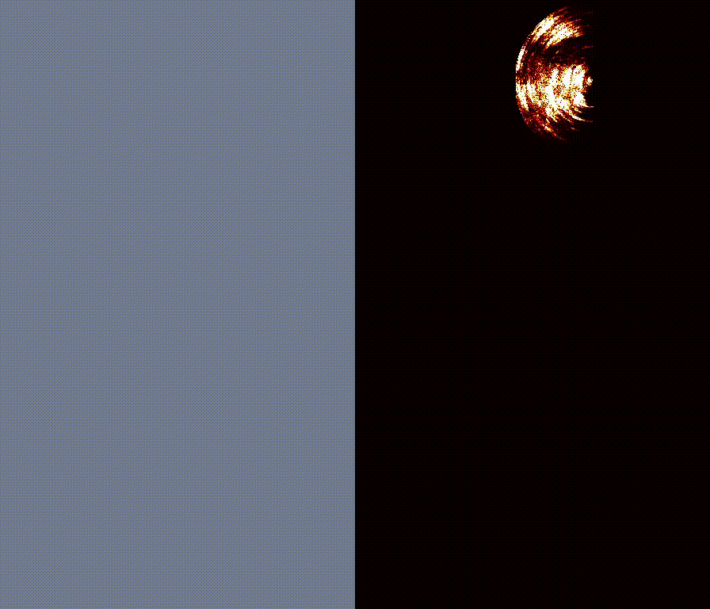

# probability mapping for mmWave radar

## Prepare environment

create conda env

```
conda env create --file conda.yaml
```

install mmwcas for dataloading and basic signal processing

```
pip install ./mmwcas --verbose
```

## Download Dataset

Download example sequence from the [link](https://huggingface.co/datasets/rpmeadf/rpm)
```
huggingface-cli download --repo-type dataset rpmeadf/rpm
```
We can only release part of the data without revealing the author's identity due to storage limits.

## Run mapping

```
python map_sar.py --folder north_short --save-video --name test
```

You can find the result folder under exps/map_sar



